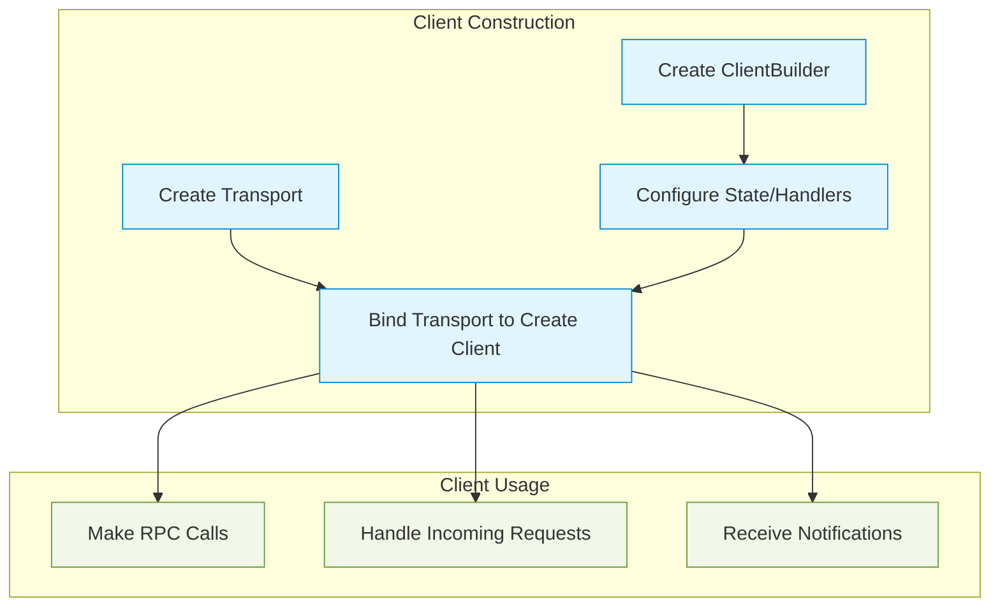
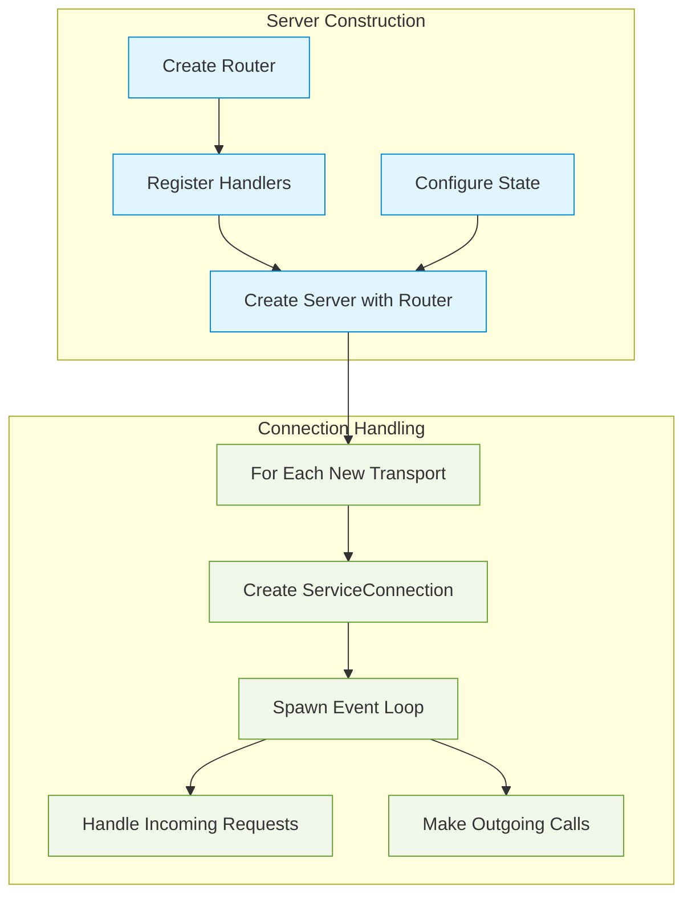
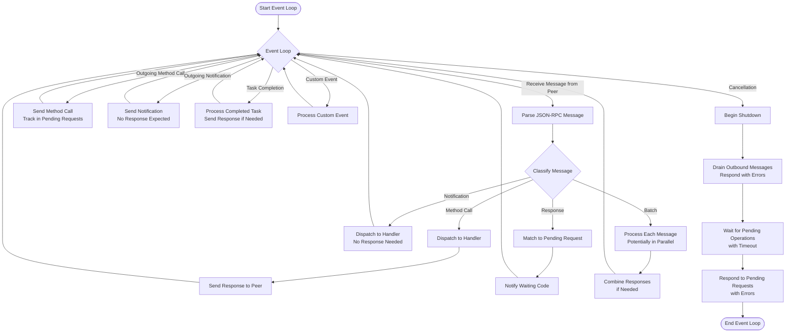
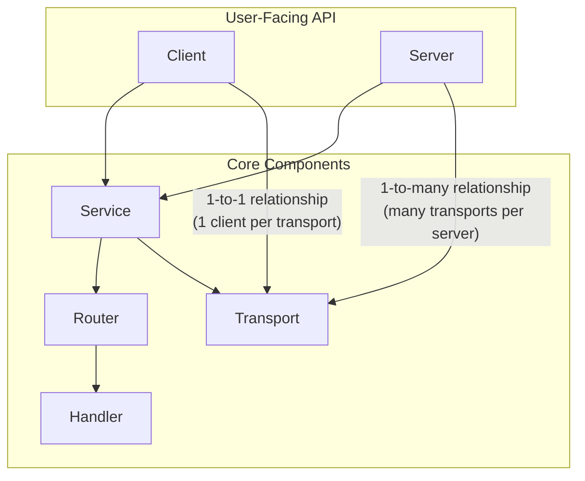
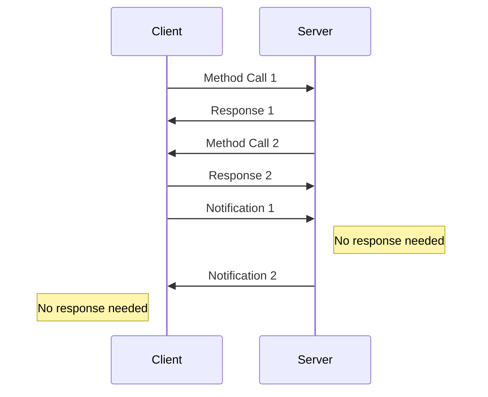

# mcpox-jsonrpc Architecture

This document describes the architecture of the `mcpox-jsonrpc` crate, which provides a purpose-built JSON-RPC 2.0 implementation for the MCP project.

## Overview

The `mcpox-jsonrpc` crate implements the [JSON-RPC 2.0 specification](https://www.jsonrpc.org/specification), focusing on bi-directional communication where both client and server can send requests to each other. The architecture follows a clear separation of concerns with modular components that can be composed together.

## Core Components and Responsibilities

### Transport Layer

**Responsibility**: Abstract the details of message transmission between peers.

The transport layer is intentionally minimal. It provides a generic `Transport` trait that defines how messages are sent and received, without including protocol-specific details like HTTP or stdio.

While the crate includes some transport implementations (primarily for testing purposes), it expects consumers to provide their own implementations for real-world use cases:

- Production code would implement `Transport` for HTTP, WebSockets, stdio, or any other communication channel
- Testing code can use the provided implementations like `(Stream, Sink)` pairs or `Framed<AsyncRead + AsyncWrite, LinesCodec>`

This approach allows the JSON-RPC implementation to be transport-agnostic and focused solely on the protocol.

### Handler Layer

**Responsibility**: Process incoming JSON-RPC requests and notifications with business logic.

Handlers are where the business logic lives. The key innovation is that you don't need to explicitly implement a `Handler` trait - instead, the crate automatically implements it for any async function with appropriate parameters and return types:

```rust
// This async function automatically becomes a handler
async fn add(Params(params): Params<AddParams>) -> Result<i64, ApiError> {
    Ok(params.a + params.b)
}

// Just register it directly with the router
router.register_handler("add", add);
```

Handlers use extractors to pull data from requests (like `Params<T>`, `State<S>`, connection handles) and can return various types that are automatically converted to JSON-RPC responses.

### Router Layer

**Responsibility**: Map method names to handlers and manage shared state.

The router maintains a registry of handlers keyed by method names and dispatches incoming requests to the appropriate handler. It also owns the shared state that is accessible to all handlers.

### Service Layer

**Responsibility**: Manage bi-directional message exchange over a connection.

The service layer is the core component that powers both clients and servers. This is a critical insight into the architecture: **in JSON-RPC, the distinction between client and server is largely artificial**. Both sides of a connection can:

1. Send method calls to the other side
2. Receive method calls from the other side
3. Send responses to method calls
4. Send and receive notifications

This peer-to-peer nature is especially important in MCP, where:
- A "client" doesn't just make calls; it also implements handlers for methods that the server can call
- A "server" doesn't just respond to calls; it can also initiate method calls to the client

#### Service and Service Connections

The `Service` and its per-connection `ServiceConnection` instances implement this bi-directional message exchange:

- **Service**: Maintains shared resources (router, handlers, state) across multiple connections
- **ServiceConnection**: Manages a single connection to a remote peer
  
Each `ServiceConnection` runs an event loop that handles:

1. **Incoming Messages**: 
   - Method calls (dispatched to handlers via the router)
   - Notifications (handled similarly but without responses)
   - Responses to previous outgoing calls (matched to pending requests)

2. **Outgoing Messages**:
   - Method calls initiated by the local peer
   - Notifications sent to the remote peer
   - Responses to incoming method calls

3. **Background Tasks**:
   - Tracking pending requests and handling timeouts
   - Managing graceful shutdown
   - Running custom event handlers
  
#### Service Configuration and Lifecycle

A `Service` is configured with:
1. A `Router` containing handlers
2. Shared state accessible to all handlers
3. Cancellation tokens for coordinated shutdown
4. Optional custom event loops that can run alongside the main message processing

```rust
// A service shares handlers and state across all connections
// Each connection (whether client or server initiated) gets its own
// event loop and connection handler
let service = Service::new(router);

// Create a connection for each incoming transport
let (future, handle) = service.service_connection(peer)?;
tokio::spawn(future);  // Spawn the event loop

// The handle can be used to make calls or shut down the connection
let response = handle.call_with_params("method", params).await?;
```

#### Why Both Client and Server Use Service

The `Service` is at the core of both client and server because:

1. **Message Handling is Identical**: Both need to process the same message types in the same way
2. **Bi-directional Communication**: Both can initiate calls and respond to incoming requests
3. **Shared Behavior**: Connection management, request tracking, error handling, and cancellation are all identical

The only real differences between client and server are:
- **Connection Establishment**: Who initiates the connection
- **Connection Count**: Clients typically have a single connection, servers have many
- **Typical Usage Patterns**: Clients tend to initiate more calls, servers tend to respond more

But these differences are usage patterns, not fundamental architecture. The `Service` encapsulates the shared behavior, letting `Client` and `Server` focus on their specific usage patterns.

### Client and Server

**Responsibility**: Provide user-friendly APIs for using the JSON-RPC implementation.

These components are thin wrappers around the service layer, providing simple interfaces for creating JSON-RPC clients and servers:

- A `Client` wraps a single transport connection and constructs a Service with a single connection
- A `Server` uses a single Service, Router, and shared state to handle potentially many connections

## Client Construction and Usage Flow



**Key Points**:
- A Client is tied to a single transport connection
- The Client combines a Router (for handling incoming requests) with outgoing call capabilities
- When a Client is dropped, its connection is closed

## Server Construction and Usage Flow



**Key Points**:
- A Server shares its Router and State across all connections
- Each transport is wrapped in its own ServiceConnection
- The Server can handle many connections simultaneously
- When the Server is dropped, all connections are closed

## Service Connection Event Loop Details

The service connection's event loop is the heart of the system, handling all message processing:



This detailed event loop flow shows how a single service connection handles all the different types of messages that can occur in a JSON-RPC system. The same loop powers both clients and servers, with the exact same message processing logic.

## Component Composition

The components in mcpox-jsonrpc are composed together to provide a flexible, modular architecture:



## Bi-directional Communication

A key feature is that both client and server can send requests to each other, reflecting the peer-to-peer nature of JSON-RPC:



This bi-directional capability is why the `Service` layer is shared between client and server implementations. Both sides need the ability to send requests, process responses, and handle incoming calls.

## Extension Points

The architecture provides several extension points:

1. **Custom Transport** - Implement the `Transport` trait for any protocol
2. **Custom Handlers** - Implement business logic for specific RPC methods
3. **Custom State** - Provide shared state accessible to all handlers
4. **Custom Event Loop** - Add custom logic to the event loop for additional processing

This flexibility allows the crate to serve as a foundation for various JSON-RPC use cases while remaining focused on the core protocol implementation.